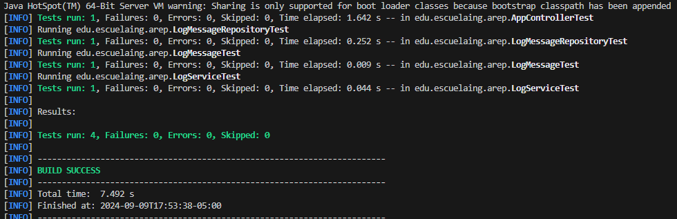

# Distributed Log Management System with Docker and MongoDB on AWS


The project is a distributed application for log management, designed with a Docker-based container architecture, deployed on AWS EC2, and utilizing several key services to process and store log messages sent by users through a web interface. The solution is deployed on AWS, using Docker to containerize the services and MongoDB for persistent storage.


## Starting

### Previous requirements

It is necessary to have "**Maven**", "**Java**" and "**MongoDB**" installed, preferably in their latest versions.

### * Maven
  ```
  Download Maven at http://maven.apache.org/download.html 

  Follow the instructions at http://maven.apache.org/download.html#Installation
  ```
### * Java

  ```
  Download Java at https://www.java.com/es/download/ie_manual.jsp
  ```

### * Mongo

  ```
  Install and run MongoDB. You can download it from https://www.mongodb.com/try/download/community.
  ```

### Running

In order to use the project on your system, you can access the following link and download a compressed file of it.

You can also clone the file using the following command.

```
git clone https://github.com/Richi025/ModularizacionConVirtualizacioneIntroduccionaDocker.git  
```
if you want to run the application use the command.

```
1. Build the project with Maven:  mvn package
```
```
2. Run the application: docker-compose up -d
```


### Installing

Once you have the cloned project in your repository. Follow the steps below to launch the program successfully

1. Open a terminal and enter the folder where I clone the repository.

2. Use the following command to compile and clean the target directory.
      ```
      mvn clean compile
      ```
3. Now use the following command to package the project as a JAR file.

      ```
      mvn package
      ```

4. Now you can run the project using the following command.

      ```
      java -jar .\target\ModularizacionConVirtualizacioneIntroduccionaDocker-1.0-SNAPSHOT.jar 
      ```
    or if you want run contairers in Docker.
    ```
    docker-compose up -d
    ```

      

5. Once the program is running, open a browser and enter the following links.

* http://localhost:8080/index.html


  


* http://localhost:8080/index.html


6. You can to access the project on AWS **The url can change over time**

    

    


## Running the tests

To run the tests you can use the following Maven command

```
mvn test
```


The following image if the execution of test.



The following image the docker containers.


## Arquitecture

  

### Component Explanation

+ **APP-LB-RoundRobin**
  - The Load Balancer that distributes incoming HTTP requests across multiple instances of the log service. It uses a Round Robin algorithm to alternate between the available services. The load balancer listens on port 8080.

+ **LogService (35001, 35002, 35003)**
  - These are three separate instances of the LogService, each running on a different port (35001, 35002, 35003). They handle the actual logging of messages by receiving them from the load balancer and saving them to MongoDB (specifically the service on port 35002).

+ **MongoDB**
  - The database that stores the logs received by the LogService. It listens on the default MongoDB port (27017) and allows for the retrieval of the latest 10 log messages in descending order of date.

+ **Web-Bootstrap**
  - A web interface built with HTML and Bootstrap that allows users to submit log messages. The form sends a POST request to the `APP-LB-RoundRobin`, which distributes the request to one of the LogService instances.

+ **Model: LogMessage**
  - The data model that represents each log message, consisting of an ID, message content, and the date when the message was created. This model is saved in the MongoDB database.

+ **Repository: LogMessageRepository**
  - The interface that handles the interaction with MongoDB. It provides methods like `findTop10ByOrderByDateDesc()` to retrieve the 10 most recent log messages.

+ **Service: LoadBalancer**
  - A service class responsible for managing the distribution of requests using the Round Robin algorithm. It maintains an array of service URLs and sends requests to the next available LogService instance.

+ **Controller: AppController**
  - The main controller that accepts log messages from the web interface (`Web-Bootstrap`) and forwards them to the `LoadBalancer` for distribution to the log services.

+ **Controller: LogService**
  - A REST controller that handles logging requests. It accepts log messages via POST requests, saves them to MongoDB, and retrieves the 10 most recent logs.

+ **RestLogApplication**
  - The Spring Boot main class that starts the entire application, including the load balancer, log services, and database connections. It also manages the application's port settings (default: 8080).


## Class Diagram

  

### Component Explanation

+ **AppController**
  - This controller handles incoming requests to the `/app/submit` endpoint. It uses the `LoadBalancer` service to forward the log message to one of the log services based on the Round Robin algorithm.

+ **LogService**
  - A controller that handles the `/logservice/log` endpoint. It receives a log message, creates a new `LogMessage` object, saves it to the MongoDB database through the `LogMessageRepository`, and retrieves the 10 most recent logs ordered by date.

+ **LogMessage**
  - A model class representing a log message, containing an ID, the log message text, and the timestamp of when the message was created. It is stored in the MongoDB database.

+ **LogMessageRepository**
  - A repository interface that extends `MongoRepository`, providing CRUD operations on the `LogMessage` model. It includes a custom method `findTop10ByOrderByDateDesc()` to fetch the 10 latest log messages.

+ **LoadBalancer**
  - A service class that implements the Round Robin load balancing algorithm. It keeps track of multiple log service URLs and alternates between them to distribute the load evenly. The class uses `RestTemplate` to send HTTP requests to the log services.

+ **RestTemplate**
  - A utility class provided by Spring that is used to perform HTTP requests. In the `LoadBalancer`, it is used to send POST requests to the log services, passing along the log message.

+ **RestLogApplication**
  - The main class for the Spring Boot application. It initializes and runs the application, setting the server port and other properties. This class is the entry point for the system.


## Built with

* [Spring Boot](https://spring.io/projects/spring-boot) - To build the controllers and backend services  
* [MongoDB](https://www.mongodb.com/) - To store and manage log messages  
* [Docker](https://www.docker.com/) - To containerize the services and facilitate their deployment  
* [AWS EC2](https://aws.amazon.com/ec2/) - To host and run the containers in the cloud  
* [Bootstrap](https://getbootstrap.com/) - To create a clean and responsive web interface


## Versioned

We use [Git](https://github.com/) for version control. For available versions, see the tags in this repository.

## Authors

* **Jose Ricardo Vasquez Vega** - [Richi025](https://github.com/Richi025)

## Date

Wednesday, September 11, 2024

## License

This project is licensed under the GNU license; See the [LICENSE.txt](LICENSE.txt) file for details.